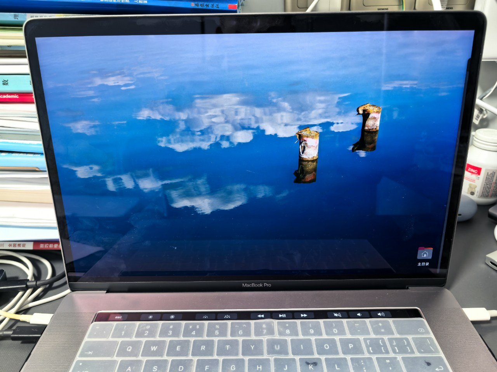

## 系统环境：
``` sh
todd@todd-MBP:~$ uname -a
Linux todd-MBP 6.17.0-19-generic #19~24.04.2-Ubuntu SMP PREEMPT_DYNAMIC Fri Mar  6 23:08:46 UTC 2 x86_64 x86_64 x86_64 GNU/Linux
```

硬件信号：`MacBook Pro 2017(Apple Inc. MacBookPro14,3)`，系统使用的是T1芯片。

检查是否适合使用此方法
1、检查芯片，此芯片可以使用此方法
``` sh
todd@todd-MBP:~/Downloads$ lsusb | grep 8600
Bus 001 Device 003: ID 05ac:8600 Apple, Inc. iBridge
```
2、检查操作系统是否已经安装了`intel_lpss_pci spi_pxa2xx_platform applespi`驱动：
``` sh
todd@todd-MBP:~$ lsmod | grep -E 'intel_lpss_pci|spi_pxa2xx_platform|applespi'
spi_pxa2xx_platform    12288  0
spi_pxa2xx_core        28672  1 spi_pxa2xx_platform
intel_lpss_pci         28672  6
intel_lpss             12288  1 intel_lpss_pci
applespi               53248  0
```

## 此仓库已经在上面的环境上验证通过。

## 1 编译驱动
### 克隆正确仓库`(mbp15)`分支
``` sh
git clone -b mbp15 https://github.com/torred/macbookpro14.3-t1-touchbar-als.git ./ibridge-tb-als
cd ./ibridge-tb-als
make
```

## 2 安装驱动
### 2.1 手动安装驱动：
  把驱动放到`/lib/modules/6.17.0-19-generic/updates/apple-ibridge`目录下面
  ``` sh
    insmod /lib/modules/6.17.0-19-generic/updates/apple-ibridge
    lsmod | grep apple
    depmod -a
```
  也可以用这个命令：`depmod -a -w $(KVERSION)  -w : 只更新指定内核的驱动依赖，不影响其他内核`

### 2.2 通过`dkms`安装驱动
```sh
    sudo ln -s "$(pwd)" /usr/src/applespi-0.1
    sudo dkms install applespi/0.1 --force
    sudo modprobe intel_lpss_pci spi_pxa2xx_platform applespi apple_ib_tb
```sh

### 2.3 驱动安装好后，可以通过下面命令检查：
#### 查看模块依赖
``` sh
  modprobe --show-depends 驱动名

  todd@todd-MBP:~/Downloads$ modprobe --show-depends apple-ib-tb
  insmod /lib/modules/6.17.0-19-generic/kernel/drivers/hid/hid.ko.zst 
  insmod /lib/modules/6.17.0-19-generic/updates/apple-ibridge/apple-ibridge.ko.zst 
  insmod /lib/modules/6.17.0-19-generic/updates/apple-ibridge/apple-ib-tb.ko.zst idle_timeout=600 dim_timeout=300 fnmode=1 

  todd@todd-MBP:~/Downloads$ modprobe --show-depends apple-ib-als
  insmod /lib/modules/6.17.0-19-generic/kernel/drivers/iio/industrialio.ko.zst 
  insmod /lib/modules/6.17.0-19-generic/kernel/drivers/hid/hid.ko.zst 
  insmod /lib/modules/6.17.0-19-generic/kernel/drivers/iio/buffer/kfifo_buf.ko.zst 
  insmod /lib/modules/6.17.0-19-generic/kernel/drivers/iio/buffer/industrialio-triggered-buffer.ko.zst 
  insmod /lib/modules/6.17.0-19-generic/updates/apple-ibridge/apple-ibridge.ko.zst 
  insmod /lib/modules/6.17.0-19-generic/updates/apple-ibridge/apple-ib-als.ko.zst 

  todd@todd-MBP:~/Downloads$ modprobe --show-depends apple-ibridge
  insmod /lib/modules/6.17.0-19-generic/kernel/drivers/hid/hid.ko.zst 
  insmod /lib/modules/6.17.0-19-generic/updates/apple-ibridge/apple-ibridge.ko.zst 
```

#### 查看模块信息/参数
``` sh
  modinfo 驱动名

  todd@todd-MBP:~/Downloads$ modinfo apple-ibridge
  filename:       /lib/modules/6.17.0-19-generic/updates/apple-ibridge/apple-ibridge.ko.zst
  license:        GPL v2
  description:    Apple iBridge driver
  author:         Ronald Tschalär
  srcversion:     1A5EE7483D7C9B35F080652
  alias:          acpi*:APP7777:*
  depends:        hid
  name:           apple_ibridge
  retpoline:      Y
  vermagic:       6.17.0-19-generic SMP preempt mod_unload modversions 

  todd@todd-MBP:~/Downloads$ modinfo apple-ib-als
  filename:       /lib/modules/6.17.0-19-generic/updates/apple-ibridge/apple-ib-als.ko.zst
  license:        GPL v2
  description:    Apple iBridge ALS driver
  author:         Ronald Tschalär
  srcversion:     D669B9F117BEA593CB841AA
  alias:          hid:b0003g*v000005ACp00008262
  alias:          hid:b0003g*v00001D6Bp00000302
  depends:        hid,apple-ibridge,industrialio,industrialio-triggered-buffer
  name:           apple_ib_als
  retpoline:      Y
  vermagic:       6.17.0-19-generic SMP preempt mod_unload modversions 

  todd@todd-MBP:~/Downloads$ modinfo apple-ib-tb或
  todd@todd-MBP:~/Downloads$ modinfo apple_ib_tb
  filename:       /lib/modules/6.17.0-19-generic/updates/apple-ibridge/apple-ib-tb.ko.zst
  license:        GPL v2
  description:    MacBookPro Touch Bar driver
  author:         Ronald Tschalär
  srcversion:     9692A3637F269474AA43A6A
  alias:          hid:b0003g*v000005ACp00008302
  alias:          hid:b0003g*v000005ACp00008102
  alias:          hid:b0003g*v00001D6Bp00000301
  depends:        hid,apple-ibridge
  name:           apple_ib_tb
  retpoline:      Y
  vermagic:       6.17.0-19-generic SMP preempt mod_unload modversions 
  parm:           idle_timeout:Default touch bar idle timeout:
        >0 - turn touch bar display off after no keyboard, trackpad, or touch bar input has been received for this many seconds;
         the display will be turned back on as soon as new input is received
        0 - turn touch bar display off (input does not turn it on again)
        -1 - turn touch bar display on (does not turn off automatically)
        -2 - disable touch bar completely (int)
  parm:           dim_timeout:Default touch bar dim timeout:
        >0 - dim touch bar display after no keyboard, trackpad, or touch bar input has been received for this many seconds
         the display will be returned to full brightness as soon as new input is received
        0 - dim touch bar display (input does not return it to full brightness)
        -1 - disable timeout (touch bar never dimmed)
        [-2] - calculate timeout based on idle-timeout (int)
  parm:           fnmode:Default Fn key mode:
        0 - function-keys only
        [1] - fn key switches from special to function-keys
        2 - inverse of 1
        3 - special keys only
        4 - escape key only (int)
```

## 3 关键修复：`T1`在`6.17`下需要重置`USB`总线才能点亮`Touch Bar`
``` sh
  sudo su
  cat <<EOF | tee /etc/systemd/system/apple.ibridge-tb.service
  [Unit]
  Description=Reset iBridge USB for Touch Bar (T1 6.17 fix)
  Before=display-manager.service

  [Service]
  Type=oneshot
  ExecStartPre=/bin/sleep 3
  ExecStart=/bin/sh -c "echo '1-3' > /sys/bus/usb/drivers/usb/unbind"
  ExecStart=/bin/sh -c "echo '1-3' > /sys/bus/usb/drivers/usb/bind"
  RemainAfterExit=yes
  TimeoutSec=0

  [Install]
  WantedBy=multi-user.target
  EOF

  sudo systemctl enable apple.ibridge-tb.service
```

## 4、控制驱动启动顺序，避免`apple_ib_tb\napple_ib_als`的资源被`hid_sensor_als`和`hid_sensor_trigger`，有三种方案：
### 方案一：
#### 在`modules`中加入需要家在的驱动，能确保驱动优先加载，且有正确的加载顺序。
`echo -e "apple_ibridge\napple_ib_tb\napple_ib_als" | sudo tee -a /etc/modules`

### 方案二：
  ``` sh
  # 在blicklist.conf中添加下面内容，禁止抢占且没用处的驱动不加载。
  sudo nano /etc/modprobe.d/blacklist-hid-sensor.conf
  # Prevent HID sensor modules from conflicting with TouchBar
  blacklist hid_sensor_als
  blacklist hid_sensor_trigger
  注意：hid_sensor_hub驱动不能加入黑名单，否则会导致touchbar启动失败。

  # 在apple-ibridge.conf中添加下面内容，控制ibridge,touchbar,lightsensor加载顺序，正确的加载顺序是ibridge->touchbar->lightsensor
  sudo nano /etc/modprobe.d/apple-ibridge.conf
  softdep apple_ib_tb pre: apple_ibridge
  softdep apple_ib_als pre: apple_ibridge apple_ib_tb
```

### 方案三：
  不禁用hid_sensor_als和hid_sensor_trigger，只通过加载顺序避免资源争抢。
``` sh
  # 在apple-ibridge.conf中添加下面内容
  softdep hid_sensor_als pre: hid_sensor_hub
  softdep hid_sensor_trigger pre: hid_sensor_hub
  softdep hid_sensor_hub pre: apple_ib_als apple_ib_tb

  softdep apple_ib_tb pre: apple_ibridge
  softdep apple_ib_als pre: apple_ibridge apple_ib_tb
```

5 配置touchbar配置参数
  在apple-ibridge.conf中添加下面内容
  ``` sh
  # touchbar参数配置
  # idle_timeout:Default touch bar idle timeout:
  #    >0 - turn touch bar display off after no keyboard, trackpad, or touch bar input has been received for this many seconds;
  #         the display will be turned back on as soon as new input is received
  #     0 - turn touch bar display off (input does not turn it on again)
  #    -1 - turn touch bar display on (does not turn off automatically)
  #    -2 - disable touch bar completely (int)
  # dim_timeout:Default touch bar dim timeout:
  #    >0 - dim touch bar display after no keyboard, trackpad, or touch bar input has been received for this many seconds
  #         the display will be returned to full brightness as soon as new input is received
  #     0 - dim touch bar display (input does not return it to full brightness)
  #    -1 - disable timeout (touch bar never dimmed)
  #    [-2] - calculate timeout based on idle-timeout (int)
  # fnmode:Default Fn key mode:
  #    0 - function-keys only
  #    [1] - fn key switches from special to function-keys
  #    2 - inverse of 1
  #    3 - special keys only
  #    4 - escape key only (int)
  options apple_ib_tb idle_timeout=600
  options apple_ib_tb dim_timeout=300
  options apple_ib_tb fnmode=1
```

## 6 重启
  重启后，检查下面项
``` sh
todd@todd-MBP:~/Downloads$ cat /sys/class/input/*/device/fnmode
1
todd@todd-MBP:~$ sudo dmesg | grep -E 'apple|ibridge|touchbar|spi'
[    0.778366] platform pxa2xx-spi.4: Adding to iommu group 15
[    0.778823] platform pxa2xx-spi.5: Adding to iommu group 17
[    0.929127] input: Apple SPI Keyboard as /devices/pci0000:00/0000:00:1e.3/pxa2xx-spi.5/spi_master/spi2/spi-APP000D:00/input/input4
[    0.931271] input: Apple SPI Touchpad as /devices/pci0000:00/0000:00:1e.3/pxa2xx-spi.5/spi_master/spi2/spi-APP000D:00/input/input5
[    0.932922] applespi spi-APP000D:00: modeswitch done.
[    3.310090] usbcore: registered new device driver apple-mfi-fastcharge
[    3.430334] apple_gmux: Found gmux version 4.0.29 [indexed]
[    3.523614] apple_ibridge: loading out-of-tree module taints kernel.
[    3.523620] apple_ibridge: module verification failed: signature and/or required key missing - tainting kernel
[    3.920146] applesmc: key=911 fan=2 temp=46 index=45 acc=0 lux=0 kbd=0
[    3.920272] applesmc applesmc.768: hwmon_device_register() is deprecated. Please convert the driver to use hwmon_device_register_with_info().
[    8.334419] apple-ibridge-hid 0003:05AC:8600.0001: : USB HID v1.01 Keyboard [Apple Inc. iBridge] on usb-0000:00:14.0-3/input2
[    8.388584] apple-ibridge-hid 0003:05AC:8600.0004: : USB HID v1.01 Device [Apple Inc. iBridge] on usb-0000:00:14.0-3/input3
[    8.599430] apple-ib-touchbar 0003:1D6B:0301.0002: input: USB HID v0.00 Keyboard [iBridge Virtual HID 0003:05AC:8600.0001/1d6b:0301] on 
[    8.599950] apple-ib-touchbar 0003:1D6B:0301.0005: : USB HID v0.00 Device [iBridge Virtual HID 0003:05AC:8600.0004/1d6b:0301] on 
[    8.691289] apple-ib-als 0003:1D6B:0302.0006: : USB HID v0.00 Device [iBridge Virtual HID 0003:05AC:8600.0004/1d6b:0302] on 
```

一般情况下会点亮touchbar，点亮touchbar后驱动的依赖关系如下：
``` sh
todd@todd-MBP:~$ lsmod | grep -E 'ib|ibridge|touchbar|sensor'
hid_sensor_hub        28672  0
apple_ib_als          16384  2
industrialio_triggered_buffer    12288  1 apple_ib_als
industrialio          139264 4 industrialio_triggered_buffer,kfifo_buf,apple_ib_als
apple_ib_tb           36864  0
apple_ibridge         20480  2 apple_ib_als,apple_ib_tb
hid                   262144 7 usbhid,apple_ib_als,hid_sensor_hub,apple_ib_tb,hid_generic,apple_ibridge,uhid
模块名               占内存   引用计数    被谁引用(依赖)

touchbar不正常时的驱动依赖关系
todd@todd-MBP:~$ lsmod | grep -E 'ib|ibridge|touchbar|sensor'
hid_sensor_als         16384   1
hid_sensor_trigger     20480   3 hid_sensor_als
hid_sensor_iio_common  24576   2 hid_sensor_trigger,hid_sensor_als
apple_ib_als           16384   0
industrialio_triggered_buffer  12288  2 hid_sensor_trigger,apple_ib_als
industrialio           139264  6 industrialio_triggered_buffer,hid_sensor_trigger,kfifo_buf,apple_ib_als,hid_sensor_als
apple_ib_tb            36864   0
hid_sensor_hub         28672   3 hid_sensor_trigger,hid_sensor_iio_common,hid_sensor_als
apple_ibridge          20480   2 apple_ib_als,apple_ib_tb
hid                    262144  7 usbhid,apple_ib_als,hid_sensor_hub,apple_ib_tb,hid_generic,apple_ibridge,uhi
```

7 附加信息：
7.1 如果想把驱动加入启动镜像（防止丢失）
``` sh
  echo -e "applespi\napple_ibridge\napple-ib-touchbar\napple-ib-tb" | sudo tee -a /etc/initramfs-tools/modules
  sudo update-initramfs -u
```

7.2 如果用ssd盒子，通过雷电3连接电脑安装的情况，如果发现重启无法识别硬盘，可以尝试下面方法。
``` sh
  sudo nano /etc/default/grub
  由：GRUB_CMDLINE_LINUX_DEFAULT="quiet splash"
  改为：GRUB_CMDLINE_LINUX_DEFAULT="quiet splash thunderbolt.host_reset=0 pcie_ports=auto"
  sudo update-grub
```

  此仓在`@roadrunner2`大神的`macbook12-spi-driver`仓基础上修改适配，并已经在`MacbookPro 2017(MacBookPro 14,3), Ubuntu 24.04.2-Kernel hwe 6.17.0-19 generic`上编译成功，并正常点亮`Touch Bar`。

  此驱动已经完成适配，并正常运行在`2017 MacBook Pro.`

## 7. 最终效果
